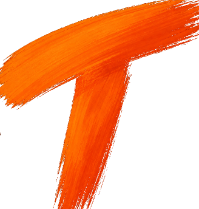
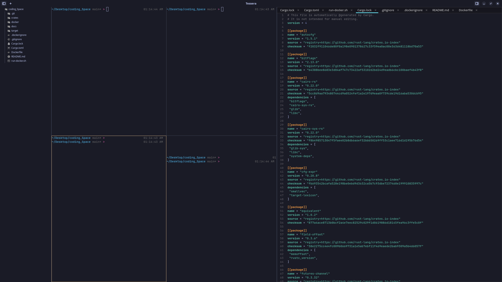
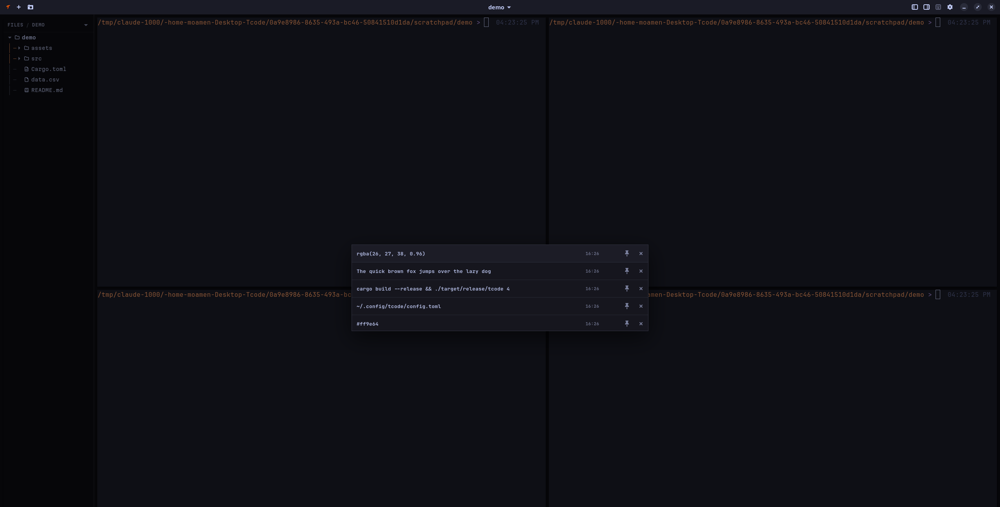
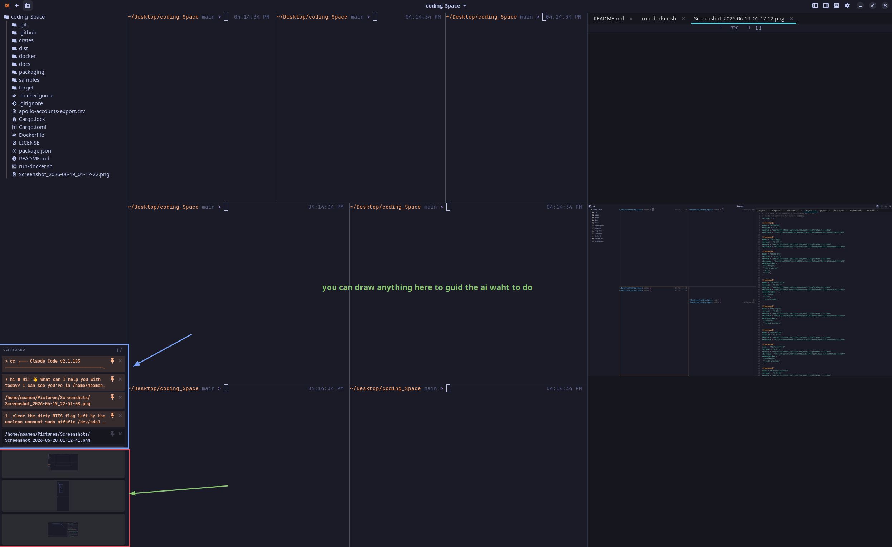

<div align="center">

# code

### The terminal workspace that tiles itself

Pick a number — get that many shells in a balanced grid.

Linux&nbsp; •&nbsp; Open source&nbsp; •&nbsp; MIT License

</div>

<br>

## Install

No Rust. No build. Three steps.

**1.** Download **`tcode_1.3.0_amd64.deb`** from the [**latest release**](https://github.com/moamen1358/Tcode/releases/latest).

**2.** Install it:

```bash
sudo apt install ./tcode_1.3.0_amd64.deb
```

**3.** Run it:

```bash
tcode        # pick how many panes
tcode 4      # straight to a 2×2 grid
```

<br>

## Features

<table width="100%">
<tr>
<td width="50%" valign="middle">
<h3>#1 Tile: Many Shells, One Grid</h3>
Pick a number, get that many panes — equal-split, no dragging, nothing to configure. Every pane is a plain login shell. Move focus, zoom one full-screen, or rebuild the whole grid, all from the keyboard.
</td>
<td width="50%" valign="middle">

</td>
</tr>
</table>

<div align="center">

### #2 View: Open Anything

Code, images, PDFs, office documents, CSV — **one viewer**, in a tab beside your panes.<br>
Ctrl+click any path to open it. The panel is width-capped, so it never crowds your terminals.

</div>

<table width="100%">
<tr>
<td width="50%" valign="middle">

</td>
<td width="50%" valign="middle">
<h3>#3 Remember: Nothing You Copy Is Lost</h3>
Every clip is captured and searchable. Hit <kbd>Alt</kbd>+<kbd>V</kbd>, type to filter, <kbd>Enter</kbd> to paste it back. Pin the ones you reuse — each remembers when you copied it.
</td>
</tr>
</table>

<table width="100%">
<tr>
<td width="50%" valign="middle">
<h3>#4 Capture: Shoot, Mark Up, Drop In</h3>
A screenshot annotator, built in. Grab a window or region, draw boxes / arrows / text in any color, then save — and drag the PNG straight into a terminal.
</td>
<td width="50%" valign="middle">

</td>
</tr>
</table>

<br>

## Shortcuts

<table width="100%">
<thead>
<tr>
<th colspan="2" align="left">Panes &amp; layout</th>
<th colspan="2" align="left">Tools &amp; system</th>
</tr>
</thead>
<tbody>
<tr>
<td width="150"><kbd>Alt</kbd> + arrows</td><td width="280">Move focus between panes (or <kbd>h</kbd><kbd>j</kbd><kbd>k</kbd><kbd>l</kbd>)</td>
<td width="180"><kbd>Alt</kbd> + <kbd>V</kbd></td><td width="220">Clipboard history</td>
</tr>
<tr>
<td><kbd>Alt</kbd> + <kbd>1</kbd>…<kbd>9</kbd></td><td>Set the pane count</td>
<td><kbd>Alt</kbd> + <kbd>P</kbd></td><td>Screenshots strip</td>
</tr>
<tr>
<td><kbd>Alt</kbd> + <kbd>N</kbd></td><td>New terminal</td>
<td><kbd>Ctrl</kbd>+<kbd>Shift</kbd>+<kbd>C</kbd> / <kbd>V</kbd></td><td>Copy / paste</td>
</tr>
<tr>
<td><kbd>Alt</kbd> + <kbd>Z</kbd></td><td>Zoom the focused pane</td>
<td><kbd>Ctrl</kbd> + <kbd>+</kbd> / <kbd>−</kbd> / <kbd>0</kbd></td><td>Zoom the UI</td>
</tr>
<tr>
<td><kbd>Alt</kbd> + <kbd>F</kbd></td><td>Fullscreen</td>
<td><kbd>Alt</kbd> + <kbd>Q</kbd></td><td>Quit</td>
</tr>
<tr>
<td><kbd>Alt</kbd> + <kbd>B</kbd></td><td>Toggle the file sidebar</td>
<td></td><td></td>
</tr>
</tbody>
</table>

<sub>All shortcuts are also in the app — open the gear (⚙) in the titlebar.</sub>

<br>

<details>
<summary><b>Configuration</b></summary>

<br>

Everything has a sensible default — a config file is optional. To tweak, create `~/.config/tcode/config.toml`:

```toml
font              = "Martian Mono"   # bundled, or any installed font
font_size         = 11
startup_command   = ""               # run in every pane on open, e.g. "tmux"
clipboard_persist = false            # keep clipboard history across restarts
scale             = 1.0              # whole-UI zoom (0.5–3.0)
# [theme] background / foreground / accent / surface / border / palette
```

PDF, office, and screenshot features light up when `poppler-utils`, `libreoffice`, and `xdg-desktop-portal` are present — the `.deb` recommends them automatically.

</details>

<details>
<summary><b>Build from source</b></summary>

<br>

```bash
sudo apt install -y build-essential pkg-config \
  libgtk-4-dev libvte-2.91-gtk4-dev libgtksourceview-5-dev
git clone https://github.com/moamen1358/Tcode && cd Tcode
./packaging/install.sh                 # build + install for your user
# …or run it in place:
cargo build --release && ./target/release/tcode 4
```

Run it three ways, all versioned from `Cargo.toml`:

```bash
./run.sh native    # host binary
./run.sh docker    # container image
./run.sh deb       # build + install the .deb
```

Maintainers: `./packaging/build-deb.sh` builds the `.deb`; pushing a `v*` tag publishes it to Releases (`.github/workflows/release.yml`).

</details>

<br>

## License

[MIT](LICENSE) © 2026 moamen. Bundled **Martian Mono** (SIL OFL) and **Tabler Icons** (MIT) keep their own licenses.
