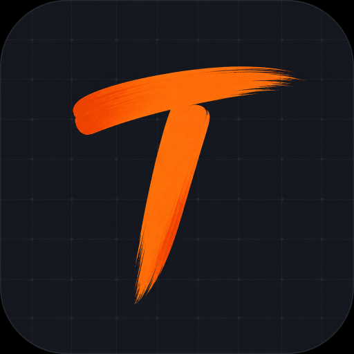

<div align="center">



# Tessera

**A fast, borderless tiling-terminal workspace for Linux.**

Pick a number → get that many terminal panes in a balanced grid. Keyboard-driven,
with a file sidebar and a built-in viewer for code, images, PDFs and office docs.


</div>

<p align="center">
  
</p>

## Download &amp; install

Grab the latest **`.deb`** from the [**Releases**](https://github.com/moamen1358/tessera/releases/latest)
page, then install it:

```bash
sudo apt install ./tessera_*.deb
```

That's it — **Tessera** shows up in your app launcher (or run `tessera`). No source
code or Rust toolchain needed; `apt` pulls in the few system libraries it uses.

## Update

```bash
tessera update
```

Checks GitHub, downloads the newest release `.deb`, and installs it. (Or just
download the new `.deb` and `apt install` it again.)

## Usage

```bash
tessera          # session picker
tessera 4        # open a 2x2 grid in the current folder
tessera --help
```

## Frame — capture &amp; annotate

The titlebar camera grabs any window or region (via the desktop screenshot
portal), then hands it to **Frame** — a built-in annotation canvas where you draw
boxes, arrows, freehand pen, highlighter, and text in any color. **Save** exports
a PNG (also copied to your clipboard) and adds it to the strip at the bottom of
the sidebar, ready to drag into a terminal.

<p align="center">
  
</p>

## Keybindings

| Key | Action |
|-----|--------|
| `Alt+h` / `j` / `k` / `l` | Move focus between panes |
| `Alt+z` | Zoom the focused pane / restore |
| `Alt+n` | New terminal (add a pane) |
| `Alt+b` | Toggle the file sidebar |
| `Alt+f` | Toggle fullscreen (no titlebar) |
| `Alt+1` … `Alt+9` | Rebuild the grid with N panes |
| `Ctrl+Shift+C` / `Ctrl+Shift+V` | Copy / paste in the focused terminal |

Ctrl+click a path or URL in any terminal to open it; right-click for Copy / Paste.

## Configuration

Optional `~/.config/tessera/config.toml` — every field has a default, so it's only
there if you want it:

```toml
font            = "Martian Mono"   # bundled; or any installed font
font_size       = 11
startup_command = ""               # e.g. "claude" to auto-run in every pane
scale           = 1.0              # whole-UI zoom (0.5–3.0)
# [theme] background / foreground / accent / surface / border / palette (Tokyo Night by default)
```

PDF / office / screenshot features light up if you also have `poppler-utils`,
`libreoffice`, and `xdg-desktop-portal` installed.

## Build from source

Prefer to build it yourself?

```bash
sudo apt install -y build-essential pkg-config \
  libgtk-4-dev libvte-2.91-gtk4-dev libgtksourceview-5-dev
git clone https://github.com/moamen1358/tessera && cd tessera
./packaging/install.sh                         # build + install for your user
# or just: cargo build --release && ./target/release/tessera 4
```

Maintainers: `./packaging/build-deb.sh` builds the `.deb`; pushing a `v*` tag
publishes it to Releases automatically (see `.github/workflows/release.yml`).

## License

[MIT](LICENSE) © 2026 moamen. Bundled assets keep their own licenses: the
**Martian Mono** font (SIL OFL) and the **Material Icon Theme** shapes (MIT).
